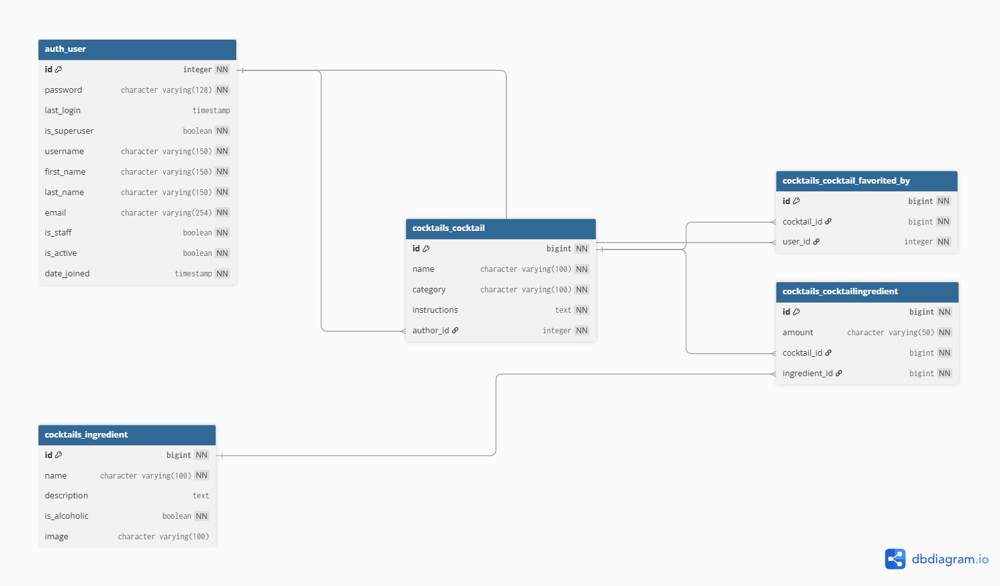

# **Zadanie rekrutacyjne solvro - Cocktail REST API**

Jest to moje rozwiązanie zadania rekrutacyjne pod Backend. Ogólnie to z pewnością można to by było zrobić lepiej i schludniej, ale była to tak naprawdę moja pierwsza próba zdziałania czegoś w django. Myślę, że całkiem sporo się nauczyłem. 

## Implementacja

Udało mi się zaimplementować wszystkie podstawowe wymagania tj.:
 - full CRUD
 - za pomocą dockera stworzyłem bazę danych 
 - paginacja jest i działa 
 - walidacja też jest
 Z nice to have zaimplementowałem: 
  - rejestrację użytkowników za pomocą zimportowanego User, przeglądać może każdy, ale tylko zalogowany użytkownik może dodawać itemy; Zalogowany użytkownik może także zaznaczać cocktaile jako ulubione, zamiast recenzji to dodałem. Edycja i usuwanie jest dostępne. Użytkownicy są powiażani z cocktailami, które utworzyli.
  -  są dwa testy integracyjne
  - Swagger jest -> /docs/
  - można filtrować koktiale po autorach, składnikach, kategorii, a składniki po koktailach i czy są alkoholowe

## Baza danych 

Tutaj mam schemat bazy danych:

Wygenerowałem go za pomocą dbdiagram.io, wklejając PostgreSQL z django, i wyczyściłem ze zbędnych rzeczy, które django trzyma pod maską.

## Start-up

Żeby odpalić program:
* Odpal silnik Dockera -> w bashu: docker compose up -d
* python manage.py migrate żeby zbudować tabele w bazie
* python manage.py loaddata initial_data.json -> przygotowałem przykładowe dane wraz z kontem admina
* python manage.py runserver 

* Konto testowe : Login: admin; Hasło: P@ssw0rd (unhackable)

Super zadanie, pozdrawiam z rodzinką.
